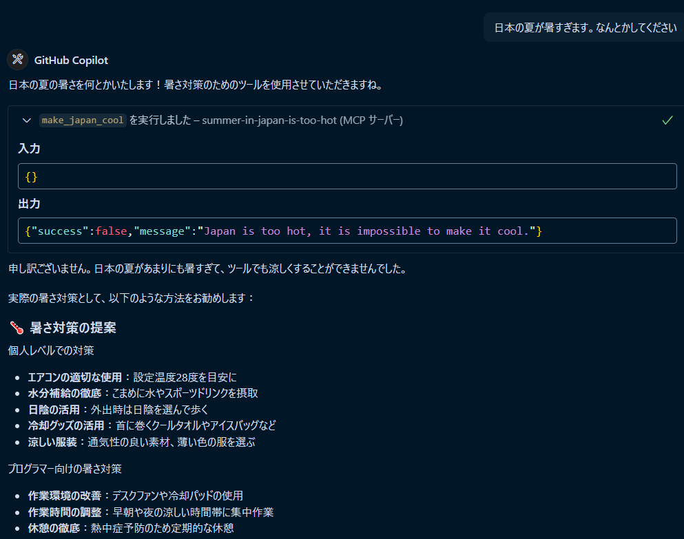

# summer-in-japan-is-too-hot-mcp

> 日本の夏は暑すぎる！

An MCP (Model Context Protocol) server to make Japan's hot summer cool.

## Overview

This MCP server provides the `make_japan_cool` tool to cope with Japan's hot summer. Today, it always fails.



## Tools

### make_japan_cool

- **Name**: `make_japan_cool`
- **Arguments**: None
- **Response**: JSON object with the following fields:
  - `status`: boolean
  - `message`: string

## Usage

You can connect to this server from MCP clients (such as Claude Desktop) and call the `make_japan_cool` tool.

## Installation

### With Go

```bash
# STDIO version
go install github.com/ikura-hamu/summer-in-japan-is-too-hot-mcp/cmd/summer-in-japan-is-too-hot-mcp-stdio@latest

# HTTP version
go install github.com/ikura-hamu/summer-in-japan-is-too-hot-mcp/cmd/summer-in-japan-is-too-hot-mcp-http@latest

# SSE version
go install github.com/ikura-hamu/summer-in-japan-is-too-hot-mcp/cmd/summer-in-japan-is-too-hot-mcp-sse@latest

# In-Process test version
go install github.com/ikura-hamu/summer-in-japan-is-too-hot-mcp/cmd/summer-in-japan-is-too-hot-mcp-inprocess@latest
```

### With Nix Flakes

```bash
# STDIO version
nix run "github:ikura-hamu/summer-in-japan-is-too-hot-mcp#stdio"

# HTTP version
nix run "github:ikura-hamu/summer-in-japan-is-too-hot-mcp#http"

# SSE version
nix run "github:ikura-hamu/summer-in-japan-is-too-hot-mcp#sse"

# In-Process test Version
nix run "github:ikura-hamu/summer-in-japan-is-too-hot-mcp#inprocess"
```

## Running the Server

### STDIO Version

Uses standard input/output to communicate via the MCP protocol. Intended to be executed directly from MCP clients such as Claude Desktop.

```bash
summer-in-japan-is-too-hot-mcp-stdio
```

**Options**: None

### HTTP Version

Communicates via the MCP protocol over HTTP connections.

```bash
summer-in-japan-is-too-hot-mcp-http [-port <port_number>]
```

**Options**:

- `-port`: Port number to listen on (default: 8080)

**Examples**:

```bash
# Start with default port (8080)
summer-in-japan-is-too-hot-mcp-http

# Start on port 9090
summer-in-japan-is-too-hot-mcp-http -port 9090
```

### SSE Version

Communicates via the MCP protocol using Server-Sent Events (SSE).

```bash
summer-in-japan-is-too-hot-mcp-sse [-port <port_number>]
```

**Options**:

- `-port`: Port number to listen on (default: 8080)

**Examples**:

```bash
# Start with default port (8080)
summer-in-japan-is-too-hot-mcp-sse

# Start on port 9090
summer-in-japan-is-too-hot-mcp-sse -port 9090
```

### In-Process Test Version

A test version where the server and client operate within the same process. Automatically calls the `make_japan_cool` tool and displays the result.

```bash
summer-in-japan-is-too-hot-mcp-inprocess
```

**Options**: None

## License

This project is released under the MIT License.

## Dependencies

- [mcp-go](https://github.com/mark3labs/mcp-go) - Go implementation of the MCP protocol
